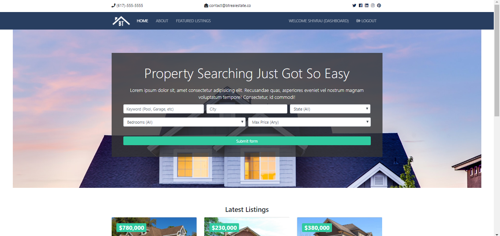
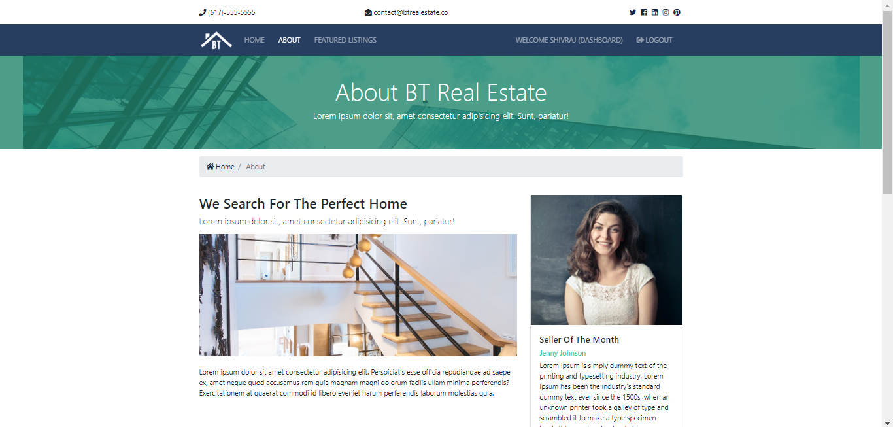
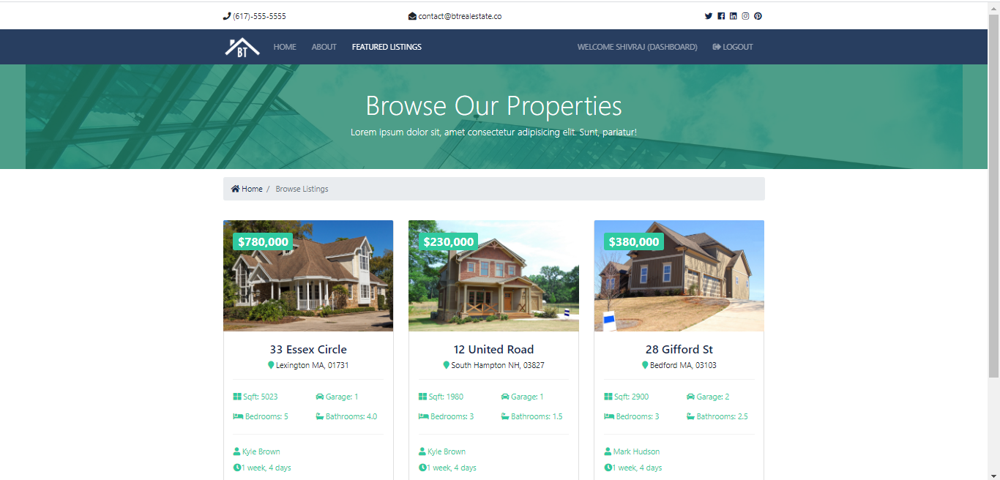
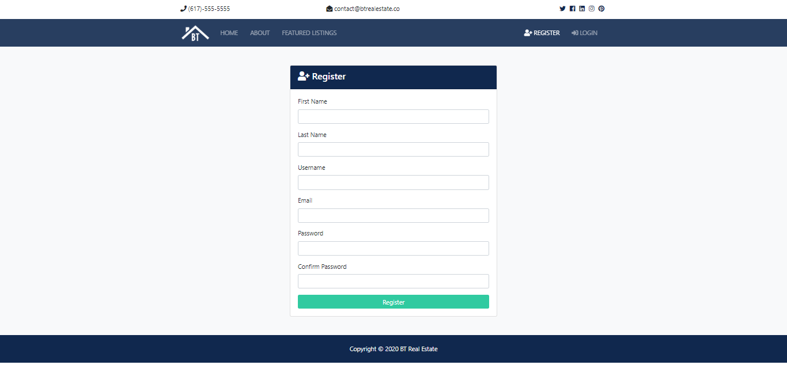
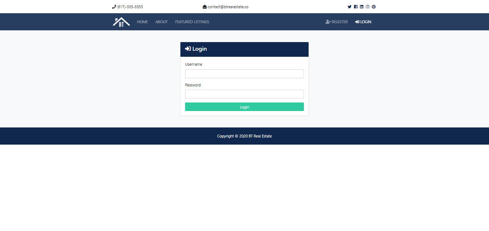
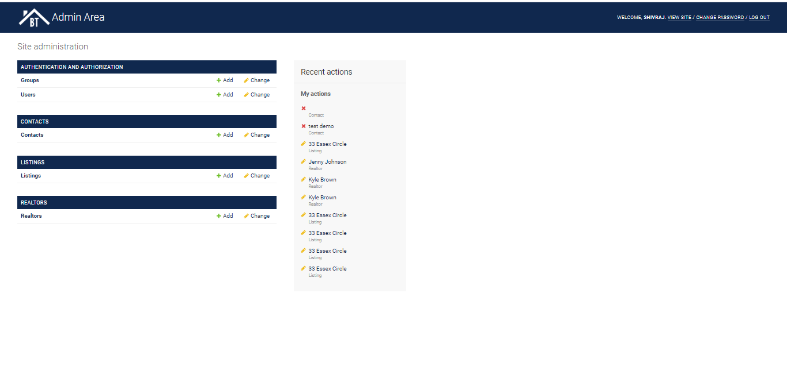

# Real Estate Django Web App
A real estate listings website built with `python` `django` `bootstrap`.

A simple, reponsive  website. Built with:

- Python
- Django
- Bootstrap 4
- Vanilla JS - ES6
- JQuery

### HomePage - Brand Section: 

### AboutPage - Products Section: 

### FeaturedListingsPage - Cart Section: 

### DashboardPage - Cart Section: 

### RegisterPage - Cart Section: 

### LoginPage - Cart Section: 

### AdminPanel - Cart Section: 

### Live Demo
_heroku_  https://realestatedjangoproject.herokuapp.com

