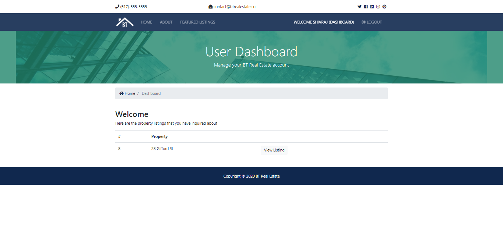

# Real Estate Django Web App

A real estate listings website built with `python` `django` `bootstrap` and `postgreSQL`
The app also has an admin panel to manage listings and realtors.
A simple, reponsive  website. Built with:

- Python 3
- Django 2
- Bootstrap 4
- Vanilla JS - ES6
- JQuery
- PostgreSQL

### HomePage: 

### AboutPage: 

### FeaturedListingsPage: 

### DashboardPage: 

### RegisterPage: 

### LoginPage: 

### AdminPanel: 

### Live Demo
_heroku_  https://realestatedjangoproject.herokuapp.com

## Acknowledgments

Many thanks to [@bradtraversy](https://github.com/bradtraversy) for his awesome course.

